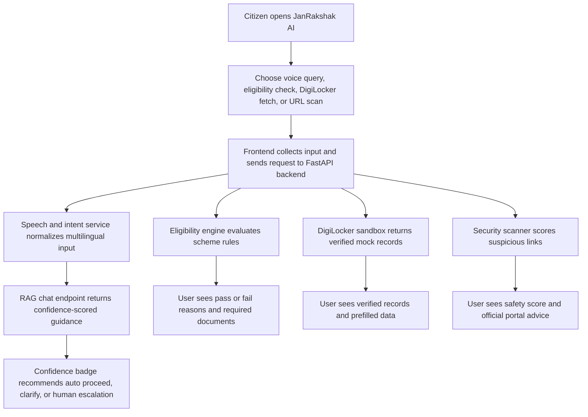

## 1. Product Overview
JanRakshak AI is a voice-first multilingual assistant that helps Indian citizens understand, verify, and apply for government welfare schemes through a guided, trustworthy digital experience.
- The product reduces scheme confusion, language barriers, documentation friction, and phishing exposure for citizens who need faster access to public benefits.
- It targets public service delivery modernization under the BHARAT PRAGATI track, with value in improved welfare reach, safer digital interactions, and higher self-service completion rates.

## 2. Core Features

### 2.1 User Roles
| Role | Registration Method | Core Permissions |
|------|---------------------|------------------|
| Citizen User | No mandatory registration for prototype | Speak queries, check eligibility, fetch mock verified documents, scan suspicious links, view AI guidance |
| Support Officer | Internal demo access | Review low-confidence escalations and inspect system recommendations |

### 2.2 Feature Module
1. **Assistant Home**: voice interaction bar, multilingual prompt suggestions, quick access cards, trust messaging.
2. **Eligibility Wizard**: step-based citizen questionnaire, real-time pass/fail checks, scheme matching, reasoning breakdown.
3. **DigiLocker Sandbox**: mock consent-driven document retrieval, verified document cards, form prefill preview.
4. **Security Dashboard**: anti-phishing URL scanner, safety score, warning indicators, official portal guidance.

### 2.3 Page Details
| Page Name | Module Name | Feature description |
|-----------|-------------|---------------------|
| Assistant Home | Voice interaction bar | Accept mock speech/text input in Hindi, Kannada, Tamil, Telugu, Marathi, and Bengali; convert to structured English intent through backend |
| Assistant Home | AI response panel | Show response text, scheme references, and confidence badge with action guidance |
| Assistant Home | Quick prompts | Offer one-tap starter prompts for scheme discovery, document fetch, and phishing checks |
| Eligibility Wizard | Scheme selector | Let users explore PM-KISAN, Ayushman Bharat, e-SHRAM, PM Awas Yojana, and PM Swanidhi |
| Eligibility Wizard | Questionnaire engine | Collect landholding, income, SECC criteria, occupation, and housing context through progressive steps |
| Eligibility Wizard | Eligibility result | Display deterministic checks, status chips, reasons, and document requirements |
| DigiLocker Sandbox | Consent action | Simulate OAuth2 consent and fetch verified mock XML-backed records |
| DigiLocker Sandbox | Document cards | Show Income Certificate, Caste Certificate, and Aadhaar metadata with digital seal styling |
| DigiLocker Sandbox | Prefill preview | Map fetched fields into scheme-ready summary data for downstream application flow |
| Security Dashboard | URL scan form | Analyze suspicious scheme links and highlight spoofing heuristics |
| Security Dashboard | Threat analysis | Detect missing HTTPS, suspicious keywords, and fraudulent domain patterns |
| Security Dashboard | Official portal verification | Reinforce safe navigation to authentic `.gov.in` and known official domains |

## 3. Core Process
Citizens land on the assistant home and choose whether to ask a question by voice, verify eligibility, fetch documents, or inspect a suspicious link. The system interprets multilingual speech into an English intent, routes the request to the correct backend service, and returns confidence-scored guidance. When scheme eligibility is checked, the wizard evaluates hard rules and explains each pass/fail criterion transparently. When trust is low, the UI clearly recommends escalation to a support officer.

## 4. User Interface Design
### 4.1 Design Style
- Primary colors: deep navy-black, government saffron glow, signal cyan, and success green
- Button style: rounded rectangular controls with luminous edge highlights and tactile hover lift
- Font and sizes: distinctive display serif for headings paired with a readable modern sans for body text; large hierarchy for accessibility
- Layout style: desktop-first, split dashboard with editorial hero section, stacked intelligence cards, and strong information grouping
- Icon style suggestions: line icons with official-dashboard character, minimal patriotic accent motifs, and clear semantic status indicators

### 4.2 Page Design Overview
| Page Name | Module Name | UI Elements |
|-----------|-------------|-------------|
| Assistant Home | Hero and trust banner | Dark atmospheric background, layered gradients, multilingual identity labels, animated signal lines, prominent microphone CTA |
| Assistant Home | Voice bar | Pulsing microphone, soundwave bars, language dropdown, suggestion chips, real-time transcript area |
| Assistant Home | AI response panel | Glassmorphism panel, confidence badge, scheme cards, supporting reasoning text |
| Eligibility Wizard | Step form | Large progress rail, accessible cards, yes/no toggles, numeric inputs, scheme status timeline |
| Eligibility Wizard | Decision panel | Pass/fail chips, criteria checklist, document requirement capsules, explanation blocks |
| DigiLocker Sandbox | Document fetch card | Consent-themed card, verified seal badges, XML record preview, prefill field grid |
| Security Dashboard | Scanner panel | URL input with analysis trigger, safety gauge, threat markers, official-domain recommendations |

### 4.3 Responsiveness
The prototype follows a desktop-first layout with tablet and mobile adaptation. Cards collapse into a single-column flow on smaller screens, controls maintain large touch targets, and voice interaction elements remain prominent without hiding key trust information.
