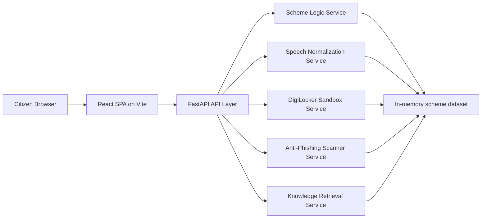
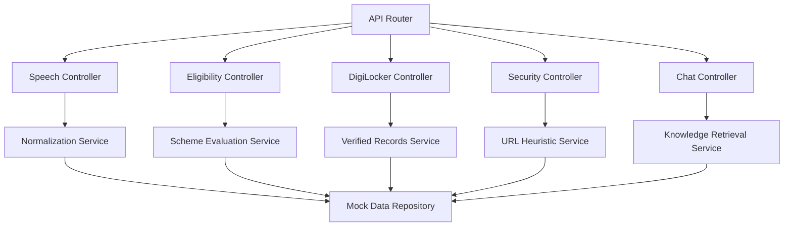
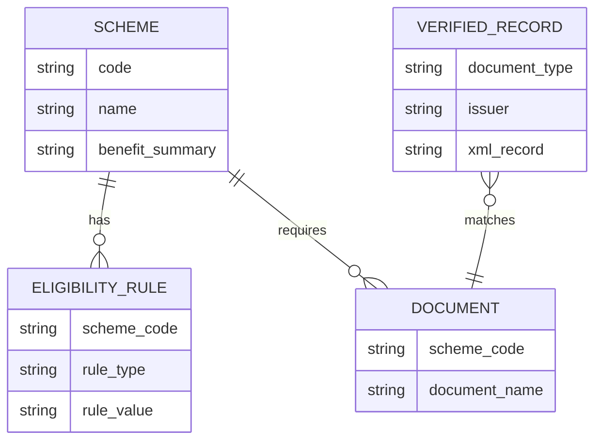

## 1. Architecture Design
JanRakshak AI uses a monorepo with a React frontend and a FastAPI backend. The frontend provides the voice-first assistant experience, while the backend handles deterministic scheme evaluation, mock speech normalization, mock DigiLocker integration, phishing heuristics, and confidence-scored knowledge responses.



## 2. Technology Description
- Frontend: React 18 + Vite + Tailwind CSS + Lucide React
- Backend: FastAPI + Uvicorn + Pydantic + Requests + Jinja2
- Initialization Tool: manual monorepo scaffolding with Vite for frontend and Python virtual environment for backend
- Data strategy: static in-memory Python mock databases for schemes and verified records
- Runtime model: local development servers with CORS enabled between `http://localhost:5173` and `http://localhost:8000`

## 3. Route Definitions
| Route | Purpose |
|-------|---------|
| / | Main assistant dashboard with voice interaction, scheme guidance, document retrieval, and security scan modules |

## 4. API Definitions

```ts
type LanguageCode = "hi" | "kn" | "ta" | "te" | "mr" | "bn" | "en";

type SpeechToTextRequest = {
  language: LanguageCode;
  text?: string;
  audio_filename?: string;
};

type SpeechToTextResponse = {
  original_language: LanguageCode;
  normalized_text: string;
  detected_intent: "scheme_discovery" | "eligibility_check" | "document_fetch" | "security_scan" | "general_query";
  entities: Record<string, string>;
};

type EligibilityPayload = {
  scheme_name: string;
  annual_income: number;
  landholding_acres?: number;
  has_secc_card?: boolean;
  occupation_code?: string;
  owns_pucca_house?: boolean;
  is_street_vendor?: boolean;
};

type EligibilityResponse = {
  scheme_name: string;
  eligible: boolean;
  matched_rules: string[];
  failed_rules: string[];
  required_documents: string[];
  benefit_summary: string;
};

type DigiLockerFetchRequest = {
  consent_token: string;
  requested_documents: Array<"income_certificate" | "caste_certificate" | "aadhaar_metadata">;
};

type DigiLockerFetchResponse = {
  consent_granted: boolean;
  documents: Array<{
    type: string;
    issuer: string;
    verified: boolean;
    xml_record: string;
    extracted_fields: Record<string, string>;
  }>;
};

type SecurityScanRequest = {
  url: string;
};

type SecurityScanResponse = {
  url: string;
  safe: boolean;
  score: number;
  indicators: string[];
  official_portal_match: boolean;
};

type ChatRequest = {
  query: string;
  language?: LanguageCode;
};

type ChatResponse = {
  answer: string;
  confidence: "high" | "medium" | "low";
  references: string[];
};
```

## 5. Server Architecture Diagram



## 6. Data Model
### 6.1 Data Model Definition



### 6.2 Data Definition Language
```sql
CREATE TABLE schemes (
  code VARCHAR(50) PRIMARY KEY,
  name VARCHAR(255) NOT NULL,
  benefit_summary TEXT NOT NULL
);

CREATE TABLE eligibility_rules (
  id INTEGER PRIMARY KEY,
  scheme_code VARCHAR(50) NOT NULL,
  rule_type VARCHAR(100) NOT NULL,
  rule_value VARCHAR(255) NOT NULL,
  FOREIGN KEY (scheme_code) REFERENCES schemes(code)
);

CREATE TABLE required_documents (
  id INTEGER PRIMARY KEY,
  scheme_code VARCHAR(50) NOT NULL,
  document_name VARCHAR(255) NOT NULL,
  FOREIGN KEY (scheme_code) REFERENCES schemes(code)
);

CREATE TABLE verified_records (
  id INTEGER PRIMARY KEY,
  document_type VARCHAR(100) NOT NULL,
  issuer VARCHAR(255) NOT NULL,
  xml_record TEXT NOT NULL
);
```
